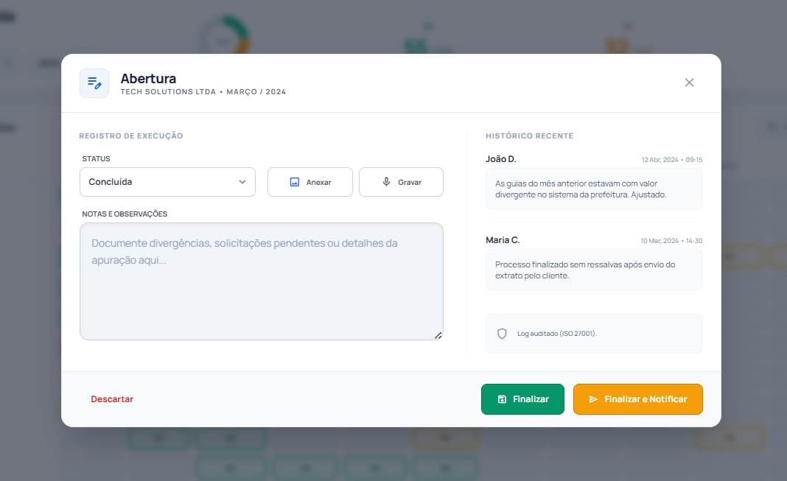
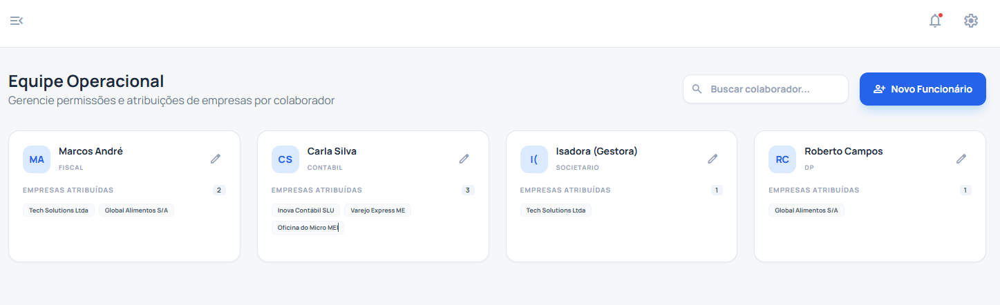

<div align="center">
  
  <h1>Aikawi RQ | Gestão Contábil Pro</h1>
  <p>
    <strong>Do Documento Word à Inteligência Operacional.</strong><br>
    Uma plataforma Web moderna para centralização, controle e auditabilidade de obrigações contábeis.
  </p>

  <p>
    
    
    
    
    
  </p>
</div>

<br />

## 🎥 A Transformação (Antes vs Depois)

> **O Problema:** Processos descentralizados em arquivos Word, sem histórico e sem métricas.
> 
> **A Solução:** Uma aplicação Web única que organiza, audita e gera inteligência sobre a operação.


---

## 🚀 Diferenciais de Valor

A migração para o **Aikawi RQ Web** entrega ROI (Retorno sobre Investimento) imediato através de:

1.  **Fim da "Caça ao Arquivo":** Eliminação de 100% do tempo gasto procurando a versão correta do documento na rede.
2.  **Auditabilidade Total:** Cada clique, alteração de status e observação é logado. Sabemos *quem* fez, *quando* e *o que* mudou.
3.  **Gestão Visual (Kanban/Checklist):** Identificação instantânea de gargalos operacionais através de indicadores de cor (OK, Pendente, Atrasado).
4.  **Inteligência Artificial:** Integração com Google Gemini para análise preditiva de gargalos na carteira de clientes.

---

## 📱 Módulos do Sistema

### 1. Dashboard Executivo
Visão macro da operação. Consolida dados de todas as empresas para oferecer métricas de eficiência em tempo real.
* **KPIs Dinâmicos:** Concluídos, Pendentes e Atrasados.
* **Insights IA:** Análise automática de tendências.
* **Gráficos Comparativos:** Volume de trabalho semestral.


### 2. Checklist Operacional (Mapa de Obrigações)
O coração da operação. Uma matriz anual que substitui as planilhas complexas.
* **Status Visual:** Cores intuitivas para rápida leitura.
* **Filtros Inteligentes:** Busque por atividade ou mês.
* **Resumo de Carteira:** Gráficos de rosca integrados ao cabeçalho.


### 3. Registro de Execução & Evidência
Padronização da entrega técnica com foco em segurança jurídica.
* **Histórico Imutável:** Timeline completa de interações.
* **Evidências Multimídia:** Gravação de áudio e anexos direto na tarefa.
* **Separação de Contexto:** Notas técnicas vs. Histórico auditado.



### 4. Gestão de Equipe & Carteira
Controle de acesso e distribuição de carga de trabalho.
* **Atribuição em Massa:** Ferramentas para configurar carteiras de clientes rapidamente.
* **Perfis de Acesso:** Gestão visual de quem atende qual empresa.



---

## 🛠️ Stack Tecnológico

O projeto foi desenvolvido com foco em performance, escalabilidade e manutenibilidade.

* **Frontend:** React.js + TypeScript
* **Build Tool:** Vite (Ultra-rápido)
* **Estilização:** Tailwind CSS (Design System consistente)
* **Dados/Gráficos:** Recharts
* **Ícones:** Google Material Symbols
* **Infraestrutura:** Docker & Docker Compose

---

## 📦 Como Rodar o Projeto

### Pré-requisitos
* Node.js 18+
* Docker (Opcional, para containerização)

### Instalação Local

```bash
# 1. Clone o repositório
git clone [https://github.com/ThiagoScutari/rq_aikawi.git](https://github.com/ThiagoScutari/rq_aikawi.git)

# 2. Instale as dependências
npm install

# 3. Configure as variáveis de ambiente
# Crie um arquivo .env.local na raiz e adicione sua chave Gemini:
# VITE_GEMINI_API_KEY=sua_chave_aqui

# 4. Rode o servidor de desenvolvimento
npm run dev